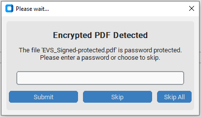
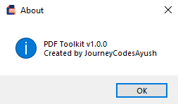

# 📄 PDF Toolkit

<!-- Badges generated using https://shields.io -->


[](https://github.com/psf/black)
[](https://pre-commit.com/)


---

## 📚 Table of Contents

- [📄 PDF Toolkit](#-pdf-toolkit)
  - [📚 Table of Contents](#-table-of-contents)
  - [📦 Latest Version](#-latest-version)
    - [✨ What's New in v1.3.0:](#-whats-new-in-v130)
    - [✨ What's New in v1.2.0:](#-whats-new-in-v120)
  - [🚀 Features](#-features)
  - [🛠 Installation](#-installation)
  - [▶️ Usage](#️-usage)
  - [🖥️ Using the CLI](#️-using-the-cli)
  - [🛡️ Code Quality](#️-code-quality)
  - [🛠 Troubleshooting](#-troubleshooting)
  - [🧱 Project Structure](#-project-structure)
  - [🧪 Testing](#-testing)
    - [✅ How to Run Tests](#-how-to-run-tests)
  - [🧬 Test Coverage](#-test-coverage)
  - [📜 Logging \& Error Handling](#-logging--error-handling)
  - [🧪 Screenshots](#-screenshots)
  - [🤝 Contributing](#-contributing)
  - [📝 License](#-license)
  - [🧾 Commit Message Convention](#-commit-message-convention)
    - [✅ Common Commit Types](#-common-commit-types)
    - [📌 Examples](#-examples)
  - [👨‍💻 Author](#-author)
  - [🙌 Special Thanks](#-special-thanks)
  - [📚 Developer Notes (Optional Read)](#-developer-notes-optional-read)

---

Welcome to **PDF Toolkit** – a clean and simple desktop app built to help you **merge**, **rename**, and **split** PDF files effortlessly. Whether you're handling academic papers, work documents, or just organizing your digital clutter, this tool gets the job done quickly and easily.

---

## 📦 Latest Version

**Version:** [v1.2.0](https://github.com/JourneyCodesAyush/PDF-Toolkit/releases/tag/v1.2.0)

**Release Date:** October 24, 2025

**Status:** Stable

**Download:** [PDF-Toolkit.v1.2.0.zip](https://github.com/JourneyCodesAyush/PDF-Toolkit/releases/download/v1.2.0/PDF-Toolkit.v1.2.0.zip)

### ✨ What's New in v1.3.0:

- 🖥️ CLI refactor: moved entry point to `cli/__main__.py` for standard Python packaging.
- 🔀 CLI now uses subcommands (`merge`, `split`, `rename`, `batch_merge`, `batch_rename`, `batch_split`) instead of flags.
- 🛡️ Improved handling for encrypted PDFs: CLI can now process encrypted PDFs with password prompts (`--skip-all` option remains available).
- 📝 Updated CLI usage examples in documentation to reflect subcommand syntax.

### ✨ What's New in v1.2.0:

- 🛡️ Added GUI prompt for encrypted PDFs: operations now ask for password instead of stopping abruptly.
- 🔗 Updated core modules to support password callbacks for encrypted PDFs.
- ⚡ Minor improvements and bug fixes.

---

## 🚀 Features

- 🔗 **Merge PDFs** – Combine multiple PDF files into one.
- ✏️ **Rename PDFs** – Give your PDF files cleaner, more meaningful names.
- ✂️ **Split PDFs** – Break up large PDFs into smaller files or extract specific pages.
- 📤 **Extract PDFs** – Extract custom page ranges or specific pages from PDFs.
- 🏷️ **Batch Processing** – Perform batch operations like merging all PDFs in a folder into one (with optional move), rename PDFs of entire folder at once, or split a PDF into multiple single-paged PDFs at once.
- 🖥️ **Command-Line Interface (CLI)** – Automate PDF operations like merge, rename, and split via terminal commands. Ideal for power users and scripting.
- 🗝️ **Encrypted PDFs Support** – When encountering an encrypted PDF, the app will prompt you for the password rather than failing silently.
- </> **CLI (v1.3.0)**: Refactored with subcommands and improved encrypted PDF support.
- 🎯 **User-friendly interface** – No learning curve, just click and go.
- ⚡ **Lightweight & fast** – Minimal dependencies and blazing performance.
- 💻 **Cross-platform** – Built with Python & Tkinter; runs on Windows and (with small tweaks) on macOS/Linux too.

---

## 🛠 Installation

To install and run PDF Toolkit locally:

1. Clone the repository:

   ```bash
   git clone https://github.com/JourneyCodesAyush/pdf-toolkit.git
   cd pdf-toolkit
   ```

2. (Recommended) Create and activate a virtual environment:

   ```bash
   python -m venv venv

   # On Linux/macOS:
   source venv/bin/activate

   # On Windows CMD:
   venv\Scripts\activate.bat

   # On Windows PowerShell:
   .\venv\Scripts\Activate.ps1
   ```

3. Install dependencies:

   ```bash
   pip install -r requirements.txt
   ```

4. (Optional) Make an executable (for Windows):

   First make sure **Pyinstaller** is installed

   ```bash
   pip install pyinstaller
   ```

   Then run:

   ```bash
   pyinstaller main.spec
   ```

💡 Tip: The generated `.exe` can be found inside `dist/`.

> **CLI Usage**: The command-line interface is included for advanced users and automation. It requires cloning the repo and running via Python scripts (see Usage section).

<details><summary>Windows Quick Launch<b></b></summary>

This project includes a `launch_windows.bat` file to help run the app on Windows.

> Note: I'm not very experienced with Batch scripting, so while this script works on my setup, it's possible that issues might come up on other systems. If you're a Windows user and run into problems, feel free to open an issue or submit a fix!

```bash
.\launch_windows.bat
```

</details>

<details><summary>Linux Quick Launch<b></b></summary>

```bash
chmod +x launch_linux.sh
launch_linux.sh
```

</details>

---

## ▶️ Usage

Start the application using:

```bash
python main.py
```

You’ll see a friendly window with three options: **Merge**, **Rename**, or **Split** your PDFs. Just follow the prompts and you’re good to go!

## 🖥️ Using the CLI

For automation or advanced use cases, PDF Toolkit includes a CLI interface.
After cloning the repo and installing dependencies, you can run:

```bash
python main_cli.py --help
or
python -m cli --help
```

This will show available commands such as:

- `merge`
- `rename`
- `split`
- `batch_merge`
- `batch_rename`
- `batch_split`
- `--version` or `-v`
- `--skip-all`

Example:

_Recommended_

```bash
python -m cli merge --input file1.pdf file2.pdf --output merged.pdf
```

> Tip: You can still run `python main_cli.py ...` but using `python -m cli` is preferred for standard Python packaging.

> 🛡️ **Note:** Encrypted PDFs are now supported in the CLI. The app will prompt for a password if needed. You can still use `--skip-all` to bypass encrypted files.

> **_Note_**: CLI is intended for users comfortable with command-line tools and requires cloning the repository and installing dependencies. The GUI remains the recommended interface for typical users.

---

## 🛡️ Code Quality

This project uses [pre-commit](https://pre-commit.com/) hooks to automatically enforce code style and catch common issues before each commit.
It includes formatting tools like [`black`](https://github.com/psf/black) and other useful checks.

Contributors are encouraged to install and run these hooks locally. Developers should refer to [CONTRIBUTING.md](CONTRIBUTING.md) for setup and usage instructions.

---

## 🛠 Troubleshooting

If you run into any issues, try the following steps:

- **Python version:**
  Make sure you are using Python 3.9 or above. Check your version with:

  ```bash
  python --version
  ```

- _Virtual environment_:
  If dependencies aren’t installing or the app crashes, try setting up and activating a virtual environment (see Installation section).

- _Missing dependencies_:
  Run

```bash
pip install -r requirements.txt
```

again to ensure all required packages are installed.

- **Permission errors**:
  On some systems, you might need to run commands with elevated permissions (e.g., sudo on Linux/Mac).

- **App doesn’t launch**:
  Check the terminal or command prompt for error messages and share them when reporting bugs.

- **Still stuck**?
  Open an issue on GitHub or contact the [author](https://github.com/journeycodesayush).

---

## 🧱 Project Structure

```
pdf_toolkit/
├── assets/               # Icons and images (e.g., app icon)
├── gui/                  # GUI layer for PDF operations
│   ├── main_window.py    # Main window structure and layout
│   ├── merge_gui.py
│   ├── rename_gui.py
│   └── split_gui.py
├── core/                 # Core PDF logic (merge, rename, split)
├── config/               # Logging and global configuration
├── tests/                # Unit and integration tests
├── logs/                 # Logs for user activity and errors
├── user_config/          # Persistent user preferences (created at runtime)
├── main.py               # Entry point of launching the app
├── requirements.txt      # Python package dependencies
├── SECURITY.md           # How to report security vulnerabilities
├── CONTRIBUTING.md       # Contribution guidelines for developers
├── CODE_OF_CONDUCT.md    # Rules for respectful collaboration
└── README.md             # You're reading it!
```

---

## 🧪 Testing

As of **_v0.7.0_**, _PDF Toolkit_ includes a growing suite of unit tests to ensure the reliability of its core and batch features.

### ✅ How to Run Tests

1. Make sure `pytest` is installed:

```bash
pip install pytest
```

2. Then from the project root, run:

```bash
pytest
```

> ⚠️**No module named core/**: Run this command

```bash
 python -m pytest
```

3. This will automatically discover and run all tests under the `tests/` directory.

## 🧬 Test Coverage

- Core modules: merge, split, rename
- Batch modules: batch-merge, batch-split, batch-rename
- Shared test fixtures in `tests/conftest.py`

Working towards expanding test coverage. Contributions welcome!

---

## 📜 Logging & Error Handling

The app is equipped with built-in logging for user actions and robust error handling. It logs user operations and captures unexpected issues to avoid crashes — helping both developers and users stay informed.

---

## 🧪 Screenshots





---

## 🤝 Contributing

Please refer to [CONTRIBUTING.md](CONTRIBUTING.md) and [CODE_OF_CONDUCT.md](CODE_OF_CONDUCT.md) before submitting pull requests.

Feel free to fork the repo, create a new branch, and send in a pull request! Bug fixes, new features, UI tweaks — it’s all welcome.

---

## 📝 License

This project is licensed under the **MIT License**.

```
MIT License

Copyright (c) 2025 JourneyCodesAyush

Permission is hereby granted, free of charge, to any person obtaining a copy
of this software and associated documentation files (the “Software”), to deal
in the Software without restriction, including without limitation the rights
to use, copy, modify, merge, publish, distribute, sublicense, and/or sell copies
of the Software, and to permit persons to whom the Software is furnished to do so,
subject to the following conditions:

The above copyright notice and this permission notice shall be included in all copies
or substantial portions of the Software.

THE SOFTWARE IS PROVIDED “AS IS”, WITHOUT WARRANTY OF ANY KIND, EXPRESS OR IMPLIED,
INCLUDING BUT NOT LIMITED TO THE WARRANTIES OF MERCHANTABILITY, FITNESS FOR A PARTICULAR
PURPOSE AND NONINFRINGEMENT. IN NO EVENT SHALL THE AUTHORS OR COPYRIGHT HOLDERS BE LIABLE
FOR ANY CLAIM, DAMAGES OR OTHER LIABILITY, WHETHER IN AN ACTION OF CONTRACT, TORT OR OTHERWISE,
ARISING FROM, OUT OF OR IN CONNECTION WITH THE SOFTWARE OR THE USE OR OTHER DEALINGS IN THE SOFTWARE.
```

---

## 🧾 Commit Message Convention

Starting with **v0.2.0**, this project follows the [Conventional Commits](https://www.conventionalcommits.org/en/v1.0.0/) standard.

Please use this format when writing commit messages:

`<type>(<scope>): <short message>`

### ✅ Common Commit Types

| Type       | Description                                           |
| ---------- | ----------------------------------------------------- |
| `feat`     | A new feature                                         |
| `fix`      | A bug fix                                             |
| `docs`     | Changes to documentation only                         |
| `style`    | Code formatting changes (no logic impact)             |
| `refactor` | Code improvements that don't fix bugs or add features |
| `test`     | Adding or modifying tests                             |
| `chore`    | Routine tasks, build scripts, config changes          |

### 📌 Examples

```bash
feat(split): add multi-range page support
fix(rename): handle non-PDF files gracefully
docs(readme): add commit message convention section
chore: update logging configuration
```

---

## 👨‍💻 Author

Crafted with care by **JourneyCodesAyush**
© 2025 JourneyCodesAyush

---

## 🙌 Special Thanks

Built with ❤️ using Python and Tkinter.
Badges powered by [Shields.io](https://shields.io)
Special thanks to ChatGPT (OpenAI) for helping with coding, documentation, and guidance.

---

## 📚 Developer Notes (Optional Read)

- Manipulating PDFs using Python's `PyPDF2` (merge, split, extract custom page ranges)
- File system handling with Python's `os` module
- Command line arguments with Python's `argparse` module
- Using `pytest` for testing, with shared `fixtures` in `conftest.py`
- Creating and auto-cleaning temporary directories with `tempfile`
- Building GUIs with Tkinter (layouts, event handling)
- Implementing robust error handling and logging
- Writing modular, well-documented Python code
- Using Git for version control, branching, and collaboration
- Writing effective, structured documentation like this README
- Added `.github/` folder containing issue and pull request templates to streamline project contributions
- Added `main.spec` for PyInstaller to facilitate building standalone executables
- CLI now fully supports encrypted PDFs with password prompts
