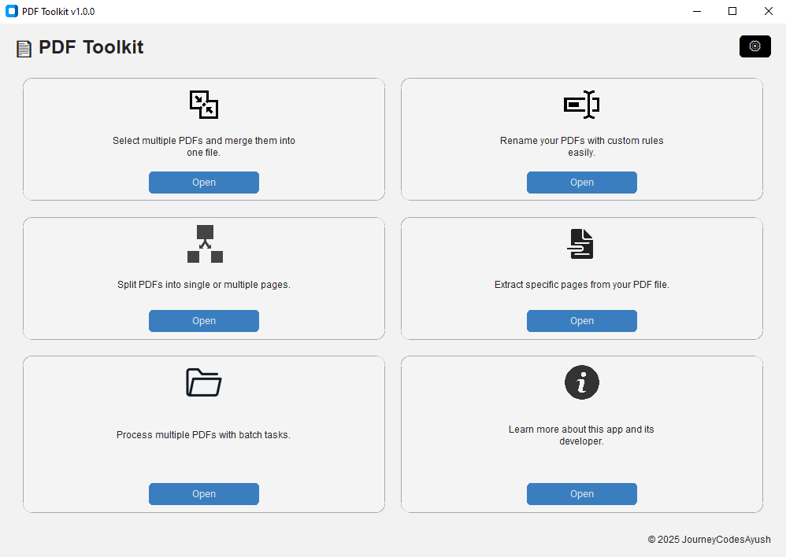
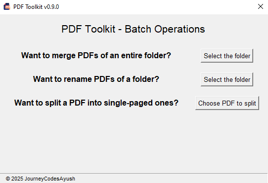

# 📄 PDF Toolkit 

<!-- Badges generated using https://shields.io -->


Welcome to **PDF Toolkit** – a clean and simple desktop app built to help you **merge**, **rename**, and **split** PDF files effortlessly. Whether you're handling academic papers, work documents, or just organizing your digital clutter, this tool gets the job done quickly and easily.

> 🚧 *This project is currently under active development. Features, structure, and design may change before the first stable release.*

---

## 📦 Latest Version

**Version:** [v0.4.0](https://github.com/JourneyCodesAyush/PDF-Toolkit/releases/tag/v0.4.0)  
**Release Date:** July 3, 2025  
**Status:** Pre-release  
**Download:** [PDF-Toolkit.v0.4.0.zip](https://github.com/JourneyCodesAyush/PDF-Toolkit/releases/download/v0.4.0/PDF-Toolkit.v0.4.0.zip)

> This is a **pre-release** of PDF Toolkit. It includes the following key improvements:

- 🛠️ **Enhanced User Experience**:
  - Added a progress bar during operations
  - Minor UI tweaks to improve accessibility.
  - Improved error reporting for file path issues.

🧪 This version is for testing purposes. Feedback and contributions are welcome!

---

## 🚀 Features

- 🔗 **Merge PDFs** – Combine multiple PDF files into one.
- ✏️ **Rename PDFs** – Give your PDF files cleaner, more meaningful names.
- ✂️ **Split PDFs** – Break up large PDFs into smaller files or extract specific pages.
- 🏷️ **Batch Processing** – Perform batch operations like merge PDFs of entire folder (and/or move to other location) into one, rename PDFs of entire folder at once, or split a PDF into multiple single-paged PDFs at once. 
- 🎯 **User-friendly interface** – No learning curve, just click and go.
- ⚡ **Lightweight & fast** – Minimal dependencies and blazing performance.
- 💻 **Cross-platform** – Built with Python & Tkinter; runs on Windows and (with small tweaks) on macOS/Linux too.

---

## 🛠 Installation

To install and run PDF Toolkit locally:

1. Clone the repository:
   ```bash
   git clone https://github.com/JourneyCodesAyush/pdf-toolkit.git
   cd pdf-toolkit
   ```

2. (Optional) Create and activate a virtual environment:
   ```bash
   python -m venv venv
   source venv/bin/activate       # On Windows: venv\Scripts\activate
   ```

3. Install dependencies:
   ```bash
   pip install -r requirements.txt
   ```

---

## ▶️ Usage

Start the application using:

```bash
python main.py
```

You’ll see a friendly window with three options: **Merge**, **Rename**, or **Split** your PDFs. Just follow the prompts and you’re good to go!

---

## 🛠 Troubleshooting

If you run into any issues, try the following steps:

- **Python version:**  
  Make sure you are using Python 3.6 or above. Check your version with:  
  ```bash
  python --version 
  ```

- *Virtual environment*:
If dependencies aren’t installing or the app crashes, try setting up and activating a virtual environment (see Installation section).

- *Missing dependencies*:
Run

```bash
pip install -r requirements.txt
```
again to ensure all required packages are installed.

- **Permission errors**:
On some systems, you might need to run commands with elevated permissions (e.g., sudo on Linux/Mac).

- **App doesn’t launch**:
Check the terminal or command prompt for error messages and share them when reporting bugs.

- **Still stuck**?
Open an issue on GitHub or contact the author.

---

## 🧱 Project Structure

```
pdf_toolkit/
├── assets/               # Icons and images (e.g., app icon)
├── gui/                  # GUI layer for PDF operations
│   ├── main_window.py    # Main window structure and layout
│   ├── merge_gui.py
│   ├── rename_gui.py
│   └── split_gui.py
├── core/                 # Core PDF logic (merge, rename, split)
├── config/               # Logging and global configuration
├── logs/                 # Stores logs of user activity
├── main.py               # Entry point of the app
├── requirements.txt      # Dependency list
└── README.md             # You're reading it!
```

---

## 📜 Logging & Error Handling

The app is equipped with built-in logging for user actions and robust error handling. It logs user operations and captures unexpected issues to avoid crashes — helping both developers and users stay informed.

---

## 🧪 Screenshots




---

## 🤝 Contributing

Feel free to fork the repo, create a new branch, and send in a pull request! Bug fixes, new features, UI tweaks — it’s all welcome.

---

## 📝 License

This project is licensed under the **MIT License**.

```
MIT License

Copyright (c) 2025 JourneyCodesAyush

Permission is hereby granted, free of charge, to any person obtaining a copy
of this software and associated documentation files (the “Software”), to deal
in the Software without restriction, including without limitation the rights
to use, copy, modify, merge, publish, distribute, sublicense, and/or sell copies
of the Software, and to permit persons to whom the Software is furnished to do so,
subject to the following conditions:

The above copyright notice and this permission notice shall be included in all copies
or substantial portions of the Software.

THE SOFTWARE IS PROVIDED “AS IS”, WITHOUT WARRANTY OF ANY KIND, EXPRESS OR IMPLIED,
INCLUDING BUT NOT LIMITED TO THE WARRANTIES OF MERCHANTABILITY, FITNESS FOR A PARTICULAR
PURPOSE AND NONINFRINGEMENT. IN NO EVENT SHALL THE AUTHORS OR COPYRIGHT HOLDERS BE LIABLE
FOR ANY CLAIM, DAMAGES OR OTHER LIABILITY, WHETHER IN AN ACTION OF CONTRACT, TORT OR OTHERWISE,
ARISING FROM, OUT OF OR IN CONNECTION WITH THE SOFTWARE OR THE USE OR OTHER DEALINGS IN THE SOFTWARE.
```

---

## 🧾 Commit Message Convention

Starting with **v0.2.0**, this project follows the [Conventional Commits](https://www.conventionalcommits.org/en/v1.0.0/) standard.

Please use this format when writing commit messages:

`<type>(<scope>): <short message>`


### ✅ Common Commit Types

| Type       | Description                                           |
|------------|-------------------------------------------------------|
| `feat`     | A new feature                                         |
| `fix`      | A bug fix                                             |
| `docs`     | Changes to documentation only                         |
| `style`    | Code formatting changes (no logic impact)             |
| `refactor` | Code improvements that don't fix bugs or add features |
| `test`     | Adding or modifying tests                             |
| `chore`    | Routine tasks, build scripts, config changes          |

### 📌 Examples

```bash
feat(split): add multi-range page support  
fix(rename): handle non-PDF files gracefully  
docs(readme): add commit message convention section  
chore: update logging configuration
```

---

## 👨‍💻 Author

Crafted with care by **JourneyCodesAyush**  
© 2025 JourneyCodesAyush 

---

## 🙌 Special Thanks

Built with ❤️ using Python and Tkinter.  
Badges powered by [Shields.io](https://shields.io)  
Special thanks to ChatGPT (OpenAI) for helping with coding, documentation, and guidance.

---

## 📚 Developer Notes (Optional Read)

- How to use Python's `PyPDF2` library to manipulate PDF files (merge, split, extract pages).
- Using Python's `os` module for file system operations like checking file existence and renaming.
- Basics of building a GUI application using Tkinter.
- Implementing proper error handling and logging to make the app robust.
- Working with Git for version control and managing branches.
- Writing clean, modular code with docstrings and meaningful comments.
- Writing effective README documentation to make the project user-friendly.

